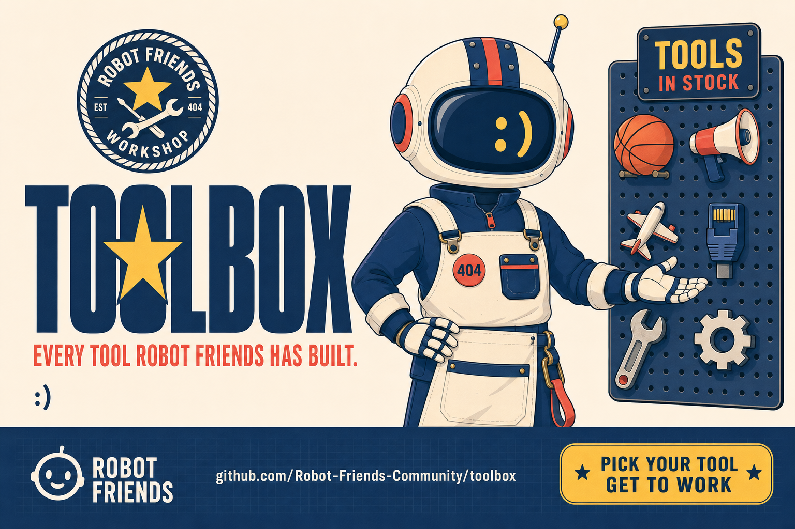

<div align="center">



</div>


<div align="center">

**Every tool Robot Friends has built — in one place.**

[](https://discord.gg/jaGWxt6rxP)
[](https://robobffs.com)

</div>

---

This repo is a directory. No code lives here — just links, descriptions, and the context you need to know what we built and whether it's useful for you.

Tools come in two flavors: **web tools** you use in a browser right now, and **developer tools** you install on your machine.

---

## Web Tools

Hosted online. Nothing to install — just open and use.

### ToolShelf
**[toolshelf.dev](https://toolshelf.dev)**

A curated directory of 1,100+ developer tools with quality scoring built in. Not just a list of links — every tool gets a composite score (0–100) based on GitHub activity, documentation quality, community size, and download metrics. You can also filter by maintenance status (actively maintained vs. going quiet) so you don't adopt something that's already dying.

**What makes it different from Awesome lists:**
- Live quality scores pulled from real GitHub data, not human opinions
- Maintenance status tracking — know before you commit
- MCP server integration — searchable directly inside Claude, Cursor, and other AI coding agents
- Free API (100 req/day) if you want to build on top of it

```
╭─ Quick access ───────────────────────────────────────────────────╮
│                                                                   │
│   Browse:  toolshelf.dev                                          │
│   API:     toolshelf.dev/api                                      │
│   MCP:     toolshelf.dev/mcp  (use inside Claude Code)           │
│                                                                   │
╰───────────────────────────────────────────────────────────────────╯
```

---

## Developer Tools

Install these on your machine. All open source, MIT licensed.

<!-- BEGIN:ORG-INVENTORY (generated by tools/sync-org-inventory.py — do not edit by hand) -->
| Tool | What It Does | Install |
|---|---|---|
| **[no-look-pass](https://github.com/Robot-Friends-Community/no-look-pass)** | Context handoff for Claude Code — save your full work state before clearing context, restore it in one command. Includes Instant Replay game film logging across sessions | `git clone` + `bash install.sh` |
| **[hail](https://github.com/Robot-Friends-Community/hail)** | Voice notifications for Claude Code — 14 character voice packs so you can step away from your terminal and get called back when something needs you | `git clone` + `node bin/hail.js install` |
| **[DoPA](https://github.com/Robot-Friends-Community/dopa)** | Local-dev port registry, inspector, and do-not-kill guard — claim a safe port, see who's listening, and stop killing each other's dev servers. | `npm install -g github:Robot-Friends-Community/dopa` |
| **[Airport Authority](https://github.com/Robot-Friends-Community/airport-authority)** | Session continuity & project-lifecycle control for Claude Code — takeoff/landing handoffs, a fleet dashboard, and a concierge that scaffolds new projects. Gen-3 successor to no-look-pass. | `/plugin marketplace add` (Claude Code plugin) |
<!-- END:ORG-INVENTORY -->

---

## More Coming

We build things when we need them, then share them. This list grows as the community does.

If you built something useful for your AI workflow and want to add it here — open an issue or drop a link in the Discord. Community contributions get listed too.

---

<div align="center">

[robobffs.com](https://robobffs.com) · [discord.gg/jaGWxt6rxP](https://discord.gg/jaGWxt6rxP)

</div>
